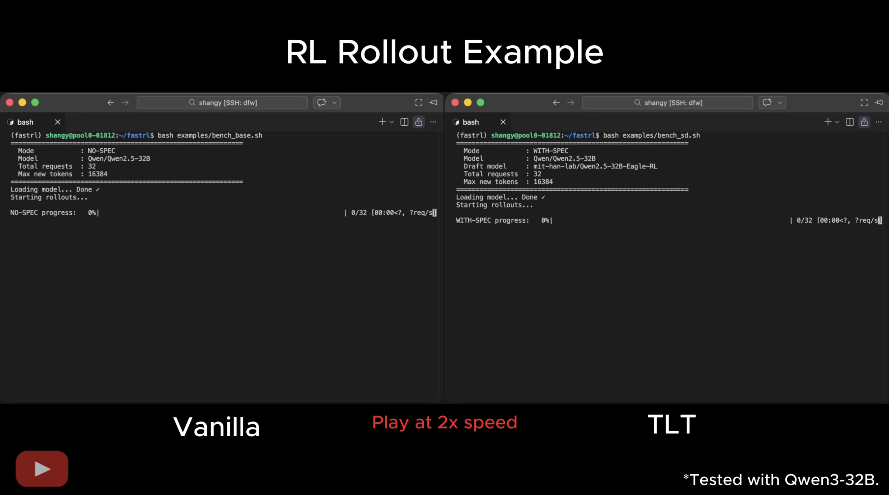

<h1 align="center">
FastRL
</h1>

<div align="center">
Efficient Reinforcement Learning for Language Models 🚀
</div>

<br>

<div align="center">

[](https://huggingface.co/collections/mit-han-lab/tlt)
[](https://arxiv.org/abs/2511.16665)

</div>


FastRL is an open-source framework for high-efficiency reasoning RL training, powered by our system TLT (Taming the Long Tail), a new approach that eliminates the long-tail rollout bottleneck in reasoning LLMs through adaptive speculative decoding. With FastRL, you can train large reasoning models drastically faster, using lossless decoding, opportunistic drafter training, and adaptive SD scheduling.

## News 📰

<strong>[2026/02]</strong> 🏆 TLT is featured on [MIT homepage](https://web.mit.edu/archive/spotlight/more-efficient-llms/) and the cover of [MIT News](https://news.mit.edu/2026/new-method-could-increase-llm-training-efficiency-0226)!

<strong>[2025/11]</strong> TLT paper is released on arXiv: [Taming the Long Tail: Efficient Reinforcement Learning for Language Models via Adaptive Speculative Decoding](https://arxiv.org/abs/2511.16665)

<strong>[2025/11]</strong> 🎉 TLT is accepted by [ASPLOS 2026](https://www.asplos-conference.org/asplos2026/)!


## Demo

[](https://www.youtube.com/watch?v=SkBsFKWawZg)

## Key Features ✨

🧠 **Lossless On-Policy RL Training** 

+ FastRL preserves the exact behavior of the underlying RL algorithm by applying mathematically lossless speculative decoding that never alters rollout distributions. 

⚡ **Adaptive Rollout Engine** 

+ A dynamic speculative decoding pipeline that automatically enables/disables SD and selects optimal SD strategies accelerates long-tail rollouts. 

🔥 **Adaptive Drafter Training**

+ A lightweight single-layer drafter continuously aligned with the evolving target model via harvesting spare GPU resources, ensuring high acceptance rates.

## Getting Started 🎯

### Installation

```bash
# Clone the repository
git clone --recursive https://github.com/mit-han-lab/fastrl.git
conda create --name fastrl python=3.12
conda activate fastrl

# Install SGLang
cd third-party/sglang
pip install -e "python[all]"

# Install flash_attn
pip install https://github.com/Dao-AILab/flash-attention/releases/download/v2.8.3/flash_attn-2.8.3+cu12torch2.8cxx11abiTRUE-cp312-cp312-linux_x86_64.whl

# Install FastRL (under the `fastrl` directory)
pip install -e .
```


### Quick Start

#### Step 1: Model Preparation

For maximum acceleration, we recommend starting from an Eagle-trained model. You can train your own using the scripts in `eagle-train/`, or use our prepared models:

[🤗 Qwen2.5-7B-Eagle-RL](https://huggingface.co/mit-han-lab/Qwen2.5-7B-Eagle-RL)

[🤗 Qwen2.5-32B-Eagle-RL](https://huggingface.co/mit-han-lab/Qwen2.5-32B-Eagle-RL)


#### Step 2: Speed Benchmark

Evaluate FastRL’s speculative decoding speedup on a sample dataset:

```bash
bash examples/bench_sd.sh
```
> [!NOTE]
> Eagle is very sensitive to the prefix. Ensure the prefix matches the RL training prefix for accurate benchmarks. A few tuning steps are sufficient for adaptation if needed.


#### Step 3: End-to-end Training

We provide complete end-to-end scripts for 7B and 32B models, for both single-node and multi-node training.

Single-node training:
```bash
bash examples/grpo_7B.sh
```


Multi-node training (Slurm):
```bash
sbatch examples/grpo_32B_multi_nodes.sh
```

> [!NOTE]
> We observe that well-trained drafter maintains high acceptance lengths over many RL steps. We do not recommend updating it every step, as this may introduce occasional contention.


## Project Structure 📁
```
fastrl/
├── verl/                          # Core RL training framework
├── eagle-train/                   # EAGLE drafter training module for drafter warm-up
├── examples/                      # Example of e2e training and benchmark scripts 
├── scripts/                       # Utility scripts
├── third-party/                   
│   └── sglang/                    # SGLang inference engine with adaptive SD support
└── data/                          # Sample datasets
```

## Acknowledgements
FastRL is built upon and inspired by several outstanding open-source projects: [VeRL](https://github.com/volcengine/verl), [SGLang](https://github.com/sgl-project/sglang), and [EAGLE](https://github.com/SafeAILab/EAGLE).


## Citation
If you find FastRL helpful or relevant to your research, please kindly cite our paper:
```bibtex
@inproceedings{TLT,
      title={Taming the Long-Tail: Efficient Reasoning RL Training with Adaptive Drafter}, 
      author={Qinghao Hu and Shang Yang and Junxian Guo and Xiaozhe Yao and Yujun Lin and Yuxian Gu and Han Cai and Chuang Gan and Ana Klimovic and Song Han},
      booktitle={Proceedings of the 31th ACM International Conference on Architectural Support for Programming Languages and Operating Systems},
      year={2026},
      series={ASPLOS '26}
}
```
